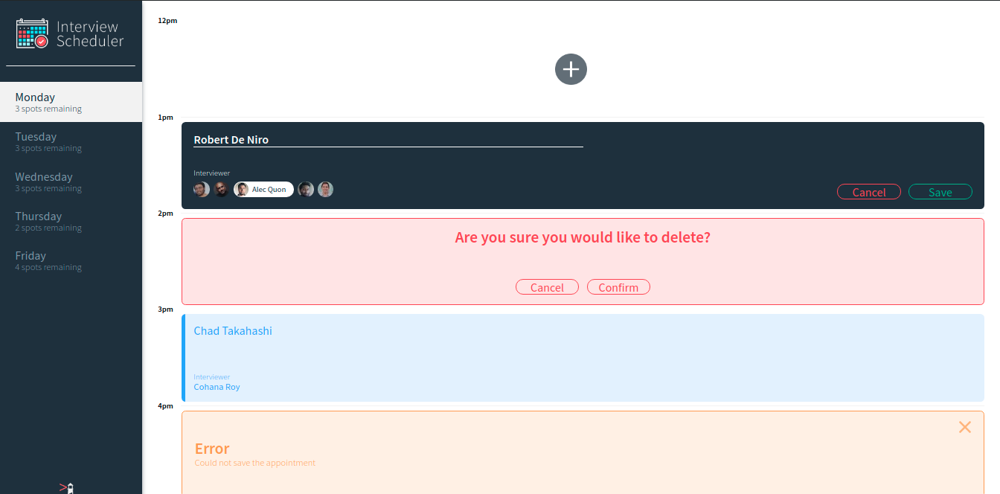

# Interview Scheduler

Scheduler is a full stack, single page React app which uses PostgreSQL and Axios, and was tested with Storybook, Jest and Cypress. 

Scheduler allows students to book and manage interviews with an interviewer. While creating the appointment, the student can enter their name and choose an interviewer, which they can edit, or delete after saving.

This app was made by Felix Rioux Sabourin in March 2020, on week 7 & 8 of [Lighthouse Labs](http://lighthouselabs.ca/)'s 12 weeks web bootcamp.



## Setup

Install dependencies with `npm install`.


## Running the api

Follow the README on the api github page:
[scheduler-api](https://github.com/FelixPriori/scheduler-api)

## Running the dashboard (optional)

Follow the README on the dashboard github page:
[scheduler-dashboard](https://github.com/FelixPriori/scheduler-dashboard)

## Running Webpack Development Server

```sh
npm start
```

## Running Jest Test Framework

```sh
npm test
```

## Running Storybook Visual Testbed

```sh
npm run storybook
```
